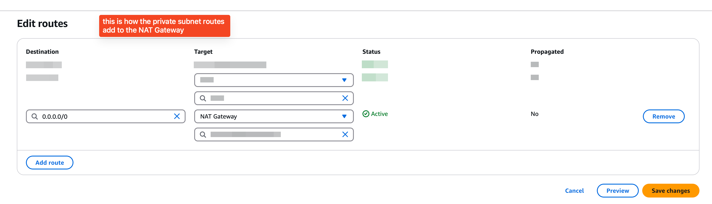

# AWS

## IAM

Dev User Group: schulichgpt_dev
Group has access to EC2, ECR, ECS, ECF
- ADD NEW DEV USERS TO THIS GROUP

## Container Registry
https://us-east-2.console.aws.amazon.com/ecr/private-registry/repositories?region=us-east-2
- schulichgpt/dev

### Push commands
  1. Retrieve an authentication token and authenticate your Docker client to your registry. Use the AWS CLI:
    `aws ecr get-login-password --region us-east-2 | docker login --username AWS --password-stdin 253921444959.dkr.ecr.us-east-2.amazonaws.com`
    Note: If you receive an error using the AWS CLI, make sure that you have the latest version of the AWS CLI and Docker installed.
  2. Build your Docker image using the following command. For information on building a Docker file from scratch see the instructions here . You can skip this step if your image is already built:
    `docker build -t schulichgpt/dev .`
    NOTE: WHEN BUILDING, SPECIFY PLATFORM AS AMD64 to ensure deployment x86_64
    `docker build -t schulichgpt/dev . --platform linux/amd64`
`
  3. After the build completes, tag your image so you can push the image to this repository:
    `docker tag schulichgpt/dev:latest 253921444959.dkr.ecr.us-east-2.amazonaws.com/schulichgpt/dev:latest`
  4. Run the following command to push this image to your newly created AWS repository:
    `docker push 253921444959.dkr.ecr.us-east-2.amazonaws.com/schulichgpt/dev:latest`

# Build Image
`docker build --platform linux/amd64 -t schulichgpt/dev-prisma -f ./docker/Dockerfile .`
`docker tag schulichgpt/dev-prisma:latest 253921444959.dkr.ecr.us-east-2.amazonaws.com/schulichgpt/dev-prisma:latest`
`docker push 253921444959.dkr.ecr.us-east-2.amazonaws.com/schulichgpt/dev-prisma:latest`

# PRISMA DATABASE MIGRATE TO POSTGRES
## Primary Problem
- Anything LLM uses a LOCAL sqlite database which is stored in "file:../storage/anythingllm.db". This is set in schema.prisma
- We need to switch this over to postgres because the amazon RDS database is based on postgres as recommended by Prisma docs (https://www.prisma.io/dataguide/postgresql/setting-up-postgresql-on-rds?query=&page=1)

## Solution
1. take the existing `server/prisma/migrations/` folder and stored it as `server/prisma/migrations.sqlite.bak`
2. create a connected EC2 instance.
  - This is needed for the following reasons
    - To migrate over the database, you need to run `yarn prisma:setup` which then creates the migrations as per the schema for postgres. The problem is that running this LOCALLY (ie. on mac) I faced a bunch of issues with connecting to the database which was likely due to subnets. I tried allowing 0.0.0.0 in bound rules to the security groups, vpc changes, adding all the subnets to the DB subnet group... but that didnt really work
    - Also, the database passwords are on a "rotation" bases so while i can simply get the password and echo command it, it would not be sustainable.
      - regarding the database password. This is a `sgpt-db-secret` in secret manager. to be able to read this secret, you need to add the policy `sgpt-allow-read-db-secret-policy` to whatever IAM roles that need to read it (eg. EC2 instance `allowEC2InstanceSecretsAccess`, Fargate Task Definition Exec role `sgpt-ecs-task-role`)
      - Also the URL that is created for the prisma db need to be encoded as per https://www.prisma.io/dataguide/postgresql/short-guides/connection-uris#percent-encoding-values -- hence the url_encode function in `docker-secrets-entrypoint`
  - how to go about setting up the EC2 and using it to do the migration
    1. went to rds database, it said no EC2 instances were connected. so i created one
      - name = prismasetup
      - added to vpc
      - added IAM role `allowEC2InstanceSecretsAccess` -- this is to let it read db secret
      - put it on the data-subnet
      - Connect to instance
        - connect using EC2 instance connect endpoint (had to create one)
      - should now be able to connect to the instance in aws's virtual console
    2. setup instance with repo and things
     - `sudo yum install git`
     - `ssh-keygen`
     - `cat .ssh/id_rsa.pub` -- add to github ssh to allow gitclone
     - `git clone git@github.com:matrix303/SchulichGPT.git`
     Setup Node
     - `curl -o- https://raw.githubusercontent.com/nvm-sh/nvm/v0.39.7/install.sh | bash`
     - `source ~/.bashrc`
     - `nvm install --lts`
     - `npm install -g yarn`
    3. Setup DB URL Env
    - `export DB_SECRET_ARN=FILL_IN_RIGHT_ARN_HERE`
    - `chmod +x docker-secrets-entrypoint.sh`
    - `./docker-secrets-entrypoint.sh` -- this should get the DB URL and appropiratley format it -- may need to use nano to enable echo of dburl
    - `export DATABASE_URL=FILL_IN_RIGHT_URL_HERE`
    4. migrate to postgres
    - `export PRISMA_SCHEMA_DISABLE_ADVISORY_LOCK=true` -- this was necessary because it was unable to get a good lock and timed out in the following command
    - `yarn prisma:setup` -- note to call this from the root schulichgpt folder
    5. should be done!
    Note - you may need to add the EC2 instance security group to the db (should just happened if you connect compute resources)

# AWS NAT Tables
- these are used to allow resources on private subnets to then access the internet.
- As of right now, we DO NOT need that capability for our database (RDS) or App to connect to the internet
- It is currently costing ~1usd a day to just keep it up when its not being used. SO i deleted it
- This is a log of the current setup so that to recreate it, this is how it is done:

### setup for VPC and subnet
- the subnet is public-2a
- vpc = sgpt

### setup for the route tables
- add this to the two APP private subnets and the two DATA private subnets (0.0.0.0 linked to NAT)

